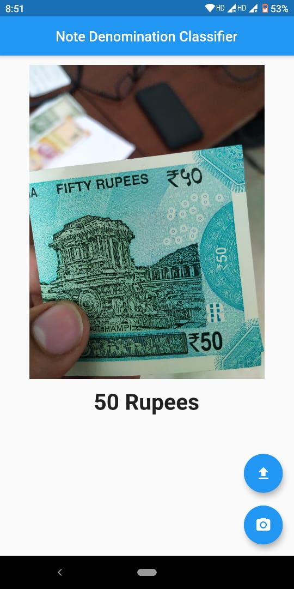
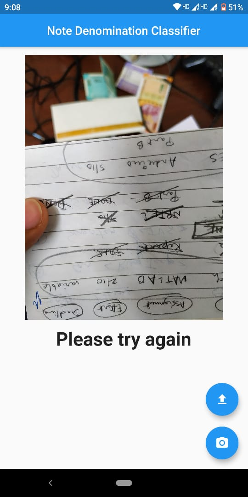
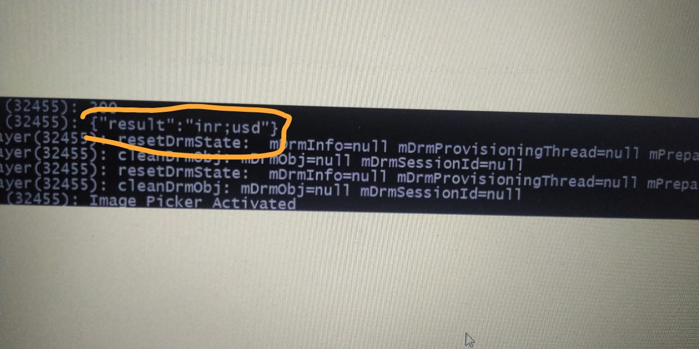

# envision
Mobile Application for the neural net project aiSight

* Uses the Web Service created by the Web Application to serve responses

# Purpose 
Simple interface considering the client convenience 


# Usage

* Extract .zip file 
* Ensure necessary dependencies are installed and import errors are resolved
```
flutter pub get
```
* Run in preferred mode
```
flutter run --profile
```

* Camera input with the touch of a button ```volume up/down```
* JSON response from server relayed as audio feedback 

# Testing

* Simple UI with single touch of a button ```volume button```



* Prompt to Retry over wrong output audio relay



## Output obtained from server in this case



# Pros 
* models with higher confidence, lower loss can be incorporated without any changes to the base confg
* reduced response delay
# Cons 
* high bandwidth requirement
* uninterrupted network connectivity
       

